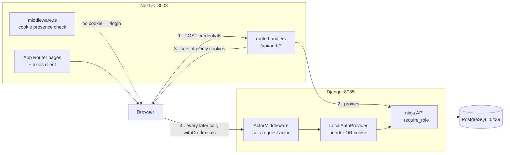

# YAHSHUA Client Monitor

Internal tool for the delivery team: YBO client contracts, client concerns
(bugs and system-customization requests), meetings, and consultant
onboarding material.

This is **not** billing. Host owns subscriptions in the sell-and-invoice
sense; this tracks contract dates and client health for the people doing
delivery.

**Status: Milestone 0.** You can log in and see the shell. There is no
client data, no ticketing and no reporting yet — see
`docs/superpowers/plans/2026-08-24-milestone-0.md` for what is and is not
built.

## Tech stack

| | |
|---|---|
| **Backend** | Python 3.12, Django 5.2, [django-ninja](https://django-ninja.dev) 1.5 (+ `ninja-extra`, `ninja-jwt`) |
| **Database** | PostgreSQL 16 |
| **Frontend** | Next.js 15 (App Router), React 19, TypeScript 5.9 (strict) |
| **Styling** | Tailwind CSS 4 — configured via `@theme` in `app/globals.css`, no `tailwind.config.js` |
| **Data fetching** | TanStack Query 5 + axios |
| **Backend tests** | pytest + pytest-django; ruff for lint and format |
| **Frontend tests** | vitest + Testing Library; Playwright for end-to-end; eslint (flat config) |
| **Containers** | Docker Compose — Postgres always, both apps behind an `apps` profile |

Versions are pinned to match the sibling `yahshua-one-numbers` repository so
conventions and reviewers transfer between them.

Deliberately **not** here: Celery, Redis, a state-management library, a
component library. Milestone 0 needs none of them.

## Architecture

Two applications that talk over HTTP. The browser reaches both directly;
only login and token refresh go through Next's own server.



**Why login is proxied but nothing else is.** The tokens must never reach
browser JavaScript. The route handler at `app/api/auth/login/route.ts`
receives them from Django and sets them as `httpOnly` cookies, returning
only the actor. Everything after that goes browser → Django directly with
`withCredentials: true`, so the cookie rides along and no script ever holds
a token. A full backend-for-frontend would have doubled the surface of
every endpoint for no additional safety.

**The identity seam.** Nothing outside `backend/accounts/` imports
`django.contrib.auth.User`. Views read `request.actor` — an `Actor` frozen
dataclass — and role checks are expressed against `Actor.role`. Swapping
the identity source (for instance, moving behind YAHSHUA One Host) means
writing one `AuthProvider` class, not editing every view. See
[How identity works](#how-identity-works).

**Refusals are typed, not generic.** `require_role` raises `Refusal` with a
machine-readable code — `not_authenticated`, `no_role`,
`role_not_permitted`, `csrf_failed`, `invalid_credentials`. Only
`not_authenticated` renders as **401**; everything else is **403**. The
frontend depends on that split to tell "your session expired" (retry after
refresh, then redirect to login) from "your role cannot do this" (show the
error, stay put).

**Two origins for one backend.** `NEXT_PUBLIC_BACKEND_ORIGIN` is what the
*browser* calls Django and is inlined into the bundle at build time.
`BACKEND_ORIGIN` is what Next's *server* calls Django. They are the same
locally and differ under Compose (`http://backend:8085`), so collapsing
them into one variable breaks one side or the other.

## Ports

Seven other processes already run on the dev machine for Host, Payroll and
Numbers. This project uses three unused ports.

| | |
|---|---|
| Django | :8085 |
| Next | :3003 ← open this one |
| PostgreSQL | :5439 |

Both applications can run **natively** (`next dev` / `manage.py runserver`)
or **containerized** (dev and production Docker targets). Neither path is
the "real" one — they publish the same ports and are interchangeable. Pick
whichever is convenient; only one can hold a given port at a time.

## First run — native

```bash
make setup          # .env, pip install, npm install
make infra          # Postgres on :5439 (Docker)
make migrate
make seed           # three users, one per role
make dev-backend    # in one terminal
make dev-frontend   # in another
```

`make setup` copies `.env.example` to `.env` for the backend. The frontend's
own defaults (`http://localhost:8085`, baked into `frontend/lib/api.ts` and
the `app/api/auth/*` route handlers) are already correct for native
development, so `frontend/.env.local` is optional there. It exists for the
case where they are not enough -- e.g. a backend on a different port or
host -- and Next.js loads it automatically:

```bash
cp frontend/.env.local.example frontend/.env.local
```

## First run — containerized

Postgres always runs in Docker; the two apps sit behind compose's `apps`
profile, so `make infra` stays Postgres-only and these targets add the rest:

```bash
make build           # build both application images
make up               # Postgres + both apps, dev targets, hot reload
# make up-prod        # production images: gunicorn, `node server.js`,
#                      # collected static files, non-root
make logs             # follow both apps
make sh-backend       # shell into the backend container
make down             # stop the apps (Postgres, started by `make infra`,
                       # keeps running — `make infra-down` stops that too)
```

`make migrate` / `make seed` still work unchanged against the containerized
Postgres — they run natively (`$(PYTHON) manage.py ...`) against the
`localhost:5439` port the `postgres` service publishes, whichever way the
apps themselves are running.

Then open http://localhost:3003 and sign in as `admin@example.com` /
`pw-12345678`. The other seeded users are `consultant@example.com` and
`engineer@example.com`, same password. `make seed` refuses to run with
`DEBUG=False`.

A note on `make`: the Makefile calls `$(PYTHON)`, which defaults to
`python3`. Plain `python` is deliberately not the default — pyenv on this
machine exposes a bare `python` shim with no version bound, and it fails
with "command not found". Point it at a virtualenv instead if you have one:
`make test-backend PYTHON=.venv/bin/python`.

## Tests

```bash
make test-backend   # pytest — 39 tests
make test-frontend  # vitest — 22 tests
make test-e2e       # Playwright — 3 tests, both servers must already be running
make test           # all three in sequence
make lint           # ruff (check + format) on the backend; eslint
                    # --max-warnings=0, tsc --noEmit and next build on
                    # the frontend
```

There is no CI. Whatever you claim about a change has to come with the
output you actually captured.

`test:unit` + `lint` alone are not enough to prove the frontend healthy: a
page module can export something Next's App Router build rejects (only
`default` plus a fixed set of framework fields are permitted from
`page.tsx`) without either eslint, `tsc --noEmit` against a stale or absent
`.next/types`, or vitest ever seeing it. Run `cd frontend && npm run build`
(with no dev server running) as part of verifying a change — it is the
only command that actually exercises Next's page-export validation.

Never run `npm run build` while `next dev` is running — it clobbers `.next`
and makes every route hang. This also applies to `make build` / `make up`
against a native `next dev` holding the same port.

`frontend/playwright.config.ts` deliberately has no `webServer` block: both
halves are expected to already be running (started by hand, or by `make
up`) before `npx playwright test` / `make test-e2e` runs. Letting Playwright
boot its own Next server while a dev server is already up is what clobbers
`.next`.

## Working on this

The repository is set up so that a change is proved, not asserted — there
is no CI to fall back on.

1. **Write the failing test first**, run it, watch it fail, then implement.
   Every task in `docs/superpowers/plans/` is structured that way.
2. **Run the checks that actually catch things:**
   ```bash
   make lint          # includes next build — see the Tests section for why
   make test-backend
   make test-frontend
   ```
3. **Drive the app, do not just render it.** A test that mounts a component
   can pass while the screen is unreachable. Start both halves and click
   through the change, or add a Playwright case.
4. **Capture the output** you are relying on. A claim without it is a guess.

Conventions worth following:

- **New screens:** add the route, then flip `built: true` for it in
  `frontend/lib/nav.ts` **in the same change**. That flag is what keeps the
  sidebar honest about which screens exist.
- **New placeholders:** anything rendered before it has real data behind it
  carries `data-placeholder`, so wiring it later is a grep.
- **New endpoints:** state the identity requirement with `require_role`, and
  raise `Refusal` with a code rather than returning a bare status. Endpoints
  use `auth=None` because `ActorMiddleware` has already resolved identity.
- **New settings:** if it is required in production, read it with **no
  default** so a missing value fails at import instead of booting wrong.

## How identity works

Feature code never touches `django.contrib.auth.User`. It reads
`request.actor`, an `Actor` frozen dataclass, and nothing else. Which
provider fills it in is one setting:

```
AUTH_PROVIDER=local     # the only implementation today
```

`local` reads a ninja-jwt token from the `Authorization: Bearer` header
**or** the `cm_access` cookie. The cookie path is what lets the token stay
`httpOnly`, so no JavaScript can read it; the header path is what keeps the
API usable from curl and tests.

The intended second provider is `host`, for when this tool moves behind
YAHSHUA One Host — it would read the identity Host forwards and map it onto
an `Actor`, so no view changes. It is not written. Setting
`AUTH_PROVIDER=host` today raises and fails a Django system check rather
than falling back to `local`; failing open on an unknown identity provider
is a defect worth not repeating.

CSRF is enforced only on the cookie path, because a cookie is what a
browser attaches to a request an attacker's page can cause. See
`backend/accounts/csrf.py`.

**One deployment constraint.** The cookie only works while both halves
share a site. `localhost:3003` and `localhost:8085` are the same site, so
local development is fine. Split them across different registrable domains
and `SameSite=Lax` silently stops sending the cookie and every call 401s.
Deploy them as one site, or move to the header path — do not loosen the
cookie to `SameSite=None`.

## Production settings

`config/settings/production.py` requires `DJANGO_SECRET_KEY` with **no
default** — a deploy missing it refuses to start rather than booting with
the (public) development secret.

Static files **are** served in production, via WhiteNoise:
`collectstatic` runs at image build time and
`CompressedManifestStaticFilesStorage` serves the fingerprinted result, so
Django admin renders styled with no separate web server. A file
`collectstatic` didn't produce fails at deploy time instead of 404ing for a
user.

`SECURE_SSL_REDIRECT` defaults to `True` (plain http gets a 301) and is
overridable via `DJANGO_SECURE_SSL_REDIRECT` — the local prod smoke test
(`docker-compose.prod.yml`) turns it off because nothing terminates TLS in
front of a container on a laptop. `SECURE_PROXY_SSL_HEADER` is gated behind
`DJANGO_TRUST_PROXY_SSL_HEADER`, **off by default**: trusting the proxy's
`X-Forwarded-Proto` header with no real proxy in front lets any client
claim `https` and silently defeats both the redirect and the secure-cookie
flags. Turn it on only behind a load balancer that actually sets that
header.

The frontend production image builds with `output: "standalone"`
(`frontend/next.config.ts`) and runs `node server.js`, not `next start` —
the standalone bundle traces only the `node_modules` files it actually
needs, leaving out the build-time tooling (TypeScript, Vite, Playwright)
that never runs in production.

## Layout

```
backend/                Django 5.2 + django-ninja
  accounts/               the identity seam
    actor.py                Actor — the only identity type feature code reads
    providers/              AuthProvider protocol + the local implementation
    middleware.py           sets request.actor on every request
    permissions.py          role checks against Actor.role
    refusals.py             Refusal(code, message)
    csrf.py                 CSRF, enforced only on the cookie path
    api.py                  login / refresh / me / logout
    views.py                the CSRF-cookie endpoint (a plain Django view)
  core/                   healthz, Refusal-to-HTTP rendering
  config/settings/        base / local / production / test
frontend/               Next 15 App Router, Tailwind 4
  app/api/auth/           the proxy route handlers — tokens stop here
  app/(app)/              the authenticated shell and its pages
  lib/api.ts              axios: withCredentials, CSRF header, one 401 retry
  lib/nav.ts              the one list of sections; built:false renders disabled
  middleware.ts           cookie presence check, redirects to /login
  e2e/                    Playwright end-to-end auth proof
docs/superpowers/
  specs/                  the design this was built from
  plans/                  the task-by-task plan
```

Unbuilt sidebar sections render disabled, not as links. A screen that is
reachable but empty and a screen that does not exist must not look the
same.
